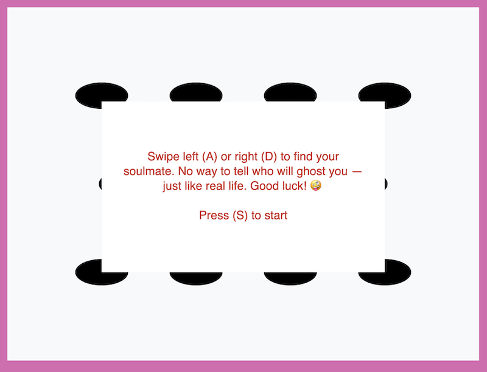
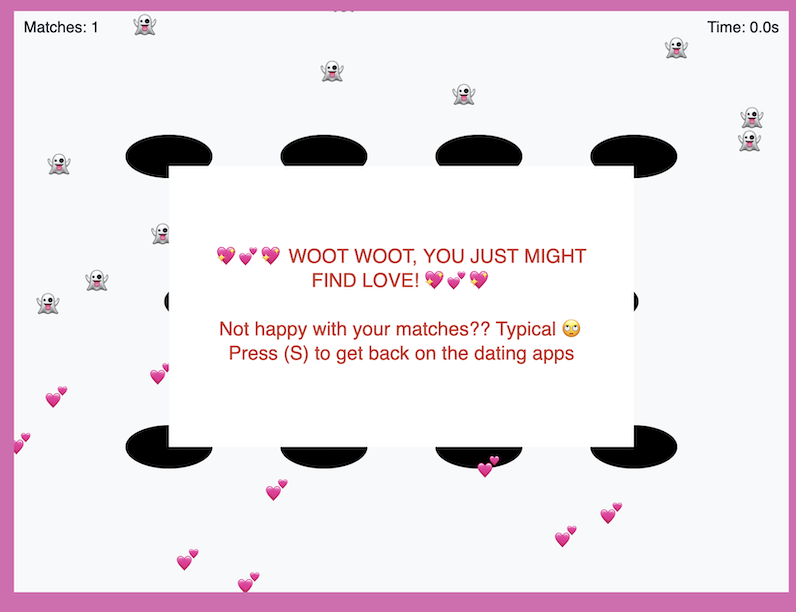
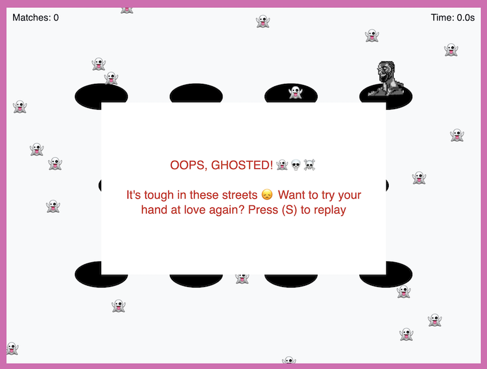

# Whac-a-Ghost

A chaotic 5-second journey through the ✨ exciting ✨ world of online dating. Profiles pop up fast — press A to match, D to reject. Choose wrong, and you just might get ghosted yourself 💔✨

  

---

Built for [Recurse Center's NGW 2025 Game Jam](https://itch.io/jam/rc-ngw-2025-game-jam). A modified version of the game can be played in Claire Froelich's [miRCo Engine](https://github.com/clairefro/miRCo-engine), but you can also play the game independently [here](https://whac-a-ghost.netlify.app/) or by building and running the code locally according to the instructions below.

---

## Local development

1. Install dependencies with `yarn`
2. Start the application with `yarn dev`
3. Open https://localhost:5173 in your browser
